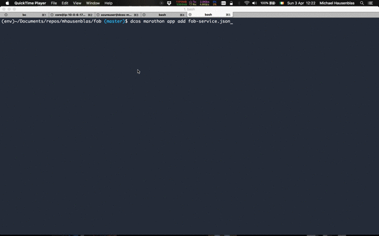

# Flock of Birds (fob)

Flock of Birds is a proof-of-concept for a serverless offering based on [DCOS](https://docs.mesosphere.com/).
It is not meant to be used in production. Its purpose is to illustrate and study the properties of
[serverless compute architectures](http://flock-of-birds.info/).

… or watch the [full demo](https://vimeo.com/161388812).

## Preparation

For the following to work, I'm assuming you've got a DCOS cluster provisioned and the [DCOS CLI](https://docs.mesosphere.com/administration/cli/) installed. Further, you want to have [jq](https://stedolan.github.io/jq/) installed, otherwise you'd need to use `grep` for certain CLI interactions.
Also, I'm using [http](http://httpie.org) for HTTP API interactions, if you don't have this or want it, you can use the respective `curl` commands instead.

You can clone this repo if you want to, but all that is really needed to launch the Flock of Birds service is `fob-service.json`, so the following is sufficient: 

    $ http --download https://raw.githubusercontent.com/mhausenblas/fob/master/fob-service.json

Note that in order to try out the steps described in the usage section below you'll need the `example/` files, so in this case cloning the repo is necessary.

To launch the Flock of Birds service, do the following:

    $ dcos marathon app add fob-service.json

To access the Flock of Birds service, you first have to figure out where it runs. It is configured to run on the public agent, and you'll need to look up its IP address (note that this is dependent on your provider, such as Azure, AWS or a private cloud IaaS offering). I've looked up the public agent IP manually in the administration UI and captured its value in the environment variable `$DCOS_PUBLIC_AGENT`:

    $ echo $DCOS_PUBLIC_AGENT
    52.33.144.9

Next, you need to find out on which port the Flock of Birds service is running. This can be achieved using the following:

    $ FOB_SERVICE_PORT="$(dcos marathon app show fob | jq .tasks[0].ports[0])"
    $ echo $FOB_SERVICE_PORT
    7937

## Usage

Now that we've launched the Flock of Birds service and have figured its whereabouts, we can use it.

Let's register two functions we want to use:

    $ http POST $DCOS_PUBLIC_AGENT:$FOB_SERVICE_PORT/api/gen < examples/python/helloworld.py
    $ http POST $DCOS_PUBLIC_AGENT:$FOB_SERVICE_PORT/api/gen < examples/python/add.py

Now let's see what functions are registered:

    $ http $DCOS_PUBLIC_AGENT:$FOB_SERVICE_PORT/api/stats
    {
        "functions": [
            "5c2e7f5f-5e57-43b0-ba48-bacf40f666ba",
            "fda0c536-2996-41a8-a6eb-693762e4d65b"
        ]
    }

Calling a function is as easy: for example the function in [helloworld.py](examples/python/helloworld.py) doesn't take any parameters and always returns the same value:

    $ http $DCOS_PUBLIC_AGENT:$FOB_SERVICE_PORT/api/call/5c2e7f5f-5e57-43b0-ba48-bacf40f666ba
    {
        "result": 42
    }

We can also pass arguments to a function; let's [add](examples/python/add.py) two numbers using the function signature `fun(param1 : number, param2 : number) -> number`:

    $ http $DCOS_PUBLIC_AGENT:$FOB_SERVICE_PORT/api/call/fda0c536-2996-41a8-a6eb-693762e4d65b?param1:1,param2:1
    {
        "result": 2
    }

Wow, we just did `1 + 1 = 2`, and that without provisioning any machines, just by uploading a code snippet ;)

## Background

### Design Principles

- Ease of use: the service should be easy to use and it should be straightforward to integrate the service (from CLI or any programming language).
- Isolation: executing different functions MUST NOT result in side effects; each function must run in its own sandbox.
- Speed: execution of a function SHOULD be as fast as possible (avoid long ramp-up times when invoking a function).

**Ease of use**. The Flock of Birds service exposes a simple HTTP API with three (public) endpoints:

- `POST /api/gen`  ...  generate a new function (sets up sandbox, launches function and returns a function ID `$fun_id`)
- `GET /api/call/$fun_id` ... call function with ID `$fun_id`
- `GET /api/stats` ... list all registered functions

Further, there are two (internal) endpoints (`/api/meta/$fun_id` and `/api/cs/$fun_id`) which are necessary for the Flock of Birds service 
to work but the end-user should not bother about them (they provide for service runtime introspection and serving the function code itself).

**Isolation** is achieved through drivers, which are programming language-dependent sandboxes, or put in other words: [Marathon app specs](https://mesosphere.github.io/marathon/docs/) templates using language specific Docker images. See for example the [Python sandbox](service/templates/python_sandbox.json).

**Speed** is realized through decoupling the registration and execution phase. In the registration phase (which can take several seconds to minutes) the function is embedded in a container and the container is launched in the DCOS cluster. When the function is invoked, the container (an app server that listens to a certain port) simply receives the request and immediately returns the result. In other words, the execution time is almost entirely determined by the properties of the function itself.

You can also experiment with the Flock of Birds service yourself, for example adding new drivers—see the notes in the [development](dev.md) section.

